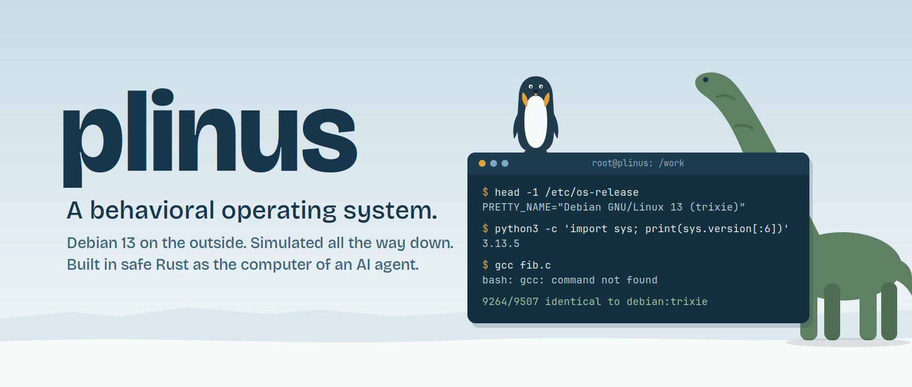

<p align="center">
  
</p>

<h1 align="center">🐧🦖 Plinus</h1>

<p align="center">
  <b>A behavioral operating system.</b><br>
  Debian 13 (trixie) on the outside. Simulated all the way down. Written in safe Rust, built to be the computer of an AI agent.
</p>

<p align="center">
  <code>9264 / 9507</code> cases byte-identical to a real <code>debian:trixie</code> · 400 programs · 45 suites · <code>#![forbid(unsafe_code)]</code>
</p>

---

## What Plinus is

Plinus (short for *pseudo-linus*) is a Linux machine that does not run Linux.

There is no kernel underneath, no hypervisor, no container, no ELF binary being executed. Every program you can call, from `ls` to `git` to `python3`, is reimplemented in Rust on top of a simulated kernel with processes, signals, pipes, loopback TCP sockets, an in-memory VFS, `/proc` and an EEVDF scheduler. Nothing touches the host.

And yet, from the inside, it is Debian 13. Programs answer byte for byte like Debian's: the same output, the same error messages, the same exit codes, the same files written to disk. What Debian does not have installed answers `command not found`, exactly like a minimal Debian would.

We call this a **behavioral operating system**: a system that is defined entirely by what it answers, faithful at the interface and fictional in the implementation.

## The thesis

Every isolation technology so far sits somewhere on the same line.

| Approach | What is simulated | What still runs for real |
| --- | --- | --- |
| Virtual machine | The hardware | A real kernel and a real userland |
| Container | Nothing (namespaces and cgroups) | The host kernel, shared |
| gVisor | The kernel, in user space | Real ELF binaries making real syscalls |
| WebAssembly / WASI | A different machine | Programs compiled for it, with a minimal non-Linux interface |
| **Plinus** | **The kernel and the whole userland** | **Nothing** |

Plinus steps off that line. It does not execute guest code at all, so it inherits properties no other class has at the same time:

- **Isolation by construction.** There is no shared kernel to escape and no hypervisor to break. The attack surface is safe Rust plus a small, audited set of dependencies.
- **Microsecond lifecycle.** A pseudo-process spawns, exits and is reaped in about 20 µs. A sandbox is a data structure; snapshots are O(1) and cost 6 ns whether the filesystem holds a thousand files or a hundred thousand.
- **Determinism.** Time, scheduling and networking are all simulated, so a session can be replayed exactly.
- **Portability.** Wherever Rust compiles, Debian goes with it.
- **Fidelity to what the model already knows.** This is the point. Language models were trained on decades of Debian terminal output. A minimal sandbox breaks those expectations on every command. Plinus gives the agent exactly the world it expects, so everything it knows applies without adjustment.

The behavioral approach has a long and respectable lineage: Wine reimplemented the Windows API instead of emulating Windows, and deterministic simulation testing (FoundationDB, TigerBeetle) showed how much a simulated world can buy you. Plinus applies the same idea to an entire Linux distribution, from the point of view of whoever is inside it.

## The oracle

Fidelity is not a claim, it is a score.

Every case in the test bench runs twice: once in Plinus and once in a real `debian:trixie` container, the **oracle**. A case only counts if stdout, stderr, exit code and every file produced are identical.

**9264 of 9507 cases identical (97.4% strict, 97.6% lenient)**, across 45 suites and 400 programs. Most suites are at 100%, including `awk`, `bc`, `date`, `diff`, `find`, `git`, `grep`, `jq`, `libc`, `ncurses`, `patch`, `regex` (1214 cases), `sed`, `shell`, `sqlite` and `yq`. `coreutils` sits at 99.2% over 1065 cases and `util-linux` at 98.5% over 1970. What pulls the average down is packaging (`dpkg`) and ELF tooling (`binutils`), both deliberately outside the project's focus.

Full scoreboard: [`docs/conformance.md`](docs/conformance.md).

For comparison, existing shell reimplementations in Rust (bashkit, rust-bash, kaish, wasmsh) were measured against the same oracle before any code was written, and none passed 44% lenient on the shell.

## Measured, not assumed

Before building, every architectural premise became a hypothesis with an experiment and a verdict. Some were confirmed, some were refuted, and the design followed the evidence. The full log lives in [`docs/bench-report.md`](docs/bench-report.md). A selection:

| Id | Hypothesis | Verdict | What the experiment found |
| --- | --- | --- | --- |
| H01 | Stackful coroutines can migrate between workers in safe Rust | Refuted | No crate offers sound migration without our own `unsafe`; one that compiles reads the wrong thread-local after migrating |
| H04 | A pseudo-process costs microseconds, and tens of thousands fit in one host process | Confirmed | Median spawn+exit+wait of 7.5 to 20 µs; 30,000 simultaneous processes in every model |
| H06 | SIGKILL by unwinding frees fds and runs Drops, blocked or looping | Confirmed | 800 of 800 kills ended with signal 9, Drops run and fds closed |
| H13 | A handwritten EEVDF reproduces the CPU split and wakeup latency of kernel 6.12 | Confirmed | Largest gap against the host kernel: 0.08 percentage points over 5 nice scenarios |
| H17 | A persistent tmpfs gives O(1) snapshot, restore and new sandbox | Confirmed | 6 ns snapshot at 1k and 100k files; 100 derived sandboxes cost 43 KiB each over a 117 MiB image |
| H18 | Delegating path resolution to the host kernel is enough to sandbox a host directory | Partial | No escapes in a million race attempts, but only our own namei matches Linux errno in 29 of 29 cases |
| H20 | `forbid(unsafe_code)` catches all of our unsafe, including macro-generated | Refuted | 7 of 9 macro-generated `unsafe` cases from other crates compiled anyway |
| H22 | Agents write sophisticated bash, but the command set is concentrated enough to prioritize | Confirmed | 56,687 real agent Bash calls: 23 commands cover 90% of uses, 98 cover 99% |
| H23 | A pure-Rust regex engine with GNU POSIX semantics exists | Partial | None alone; with our BRE/ERE translator the best reaches 100% of weighted real usage |

H22 is the one the whole project rests on. Plinus is not a guess about what agents need, it is an answer to a measured corpus.

## What is inside

- **Shell and text:** `sh`/`bash`, coreutils, util-linux, findutils, grep, sed, awk (gawk), diff, patch, xargs, column, iconv, envsubst, less/more, tree, which.
- **Data:** jq, yq, sqlite3, bc/dc, file, xxd, hexdump, strings.
- **Archives:** tar, gzip, bzip2, xz, zstd, lzip, zip/unzip, with zlib 1.3.1's and gzip's deflate reproduced byte for byte, plus `zgrep`, `zless`, `zcat` and friends.
- **System:** procps (`ps`, `top`, `kill`, `free`...), ncurses and `tput`, git, shadow, date and time zones (`date`, `zic`, `zdump`, `faketime`).
- **Local network:** `curl` 8.14.1 and `wget` 1.25.0 against servers the agent starts inside the sandbox. There is no route to the internet.
- **Python 3.13.5:** a CPython-compatible interpreter with classes, metaclasses, generators, `async`/`await`, arbitrary-precision integers, `bytearray`/`memoryview`, user imports and a large stdlib (`os`, `pathlib`, `subprocess`, `json`, `csv`, `re`, `sqlite3`, `datetime`, `decimal`, `zipfile`, `tarfile`, `gzip`, `http.server`, `urllib`, `socket`, `asyncio`, `argparse`, `logging`, `email` and more). Tracebacks match CPython's.
- **Pillow, in progress:** JPEG encode and decode on top of `zjpeg`, a port of libjpeg-turbo 2.1.5 whose output is byte-identical to Debian's Pillow `Image.save`, including progressive, subsampling, optimized Huffman, EXIF and ICC.

About 728,000 lines of Rust, in crates small enough to own: `kernel`, `sched`, `vfs`, `rbtree`, `sysabi`, `sysio`, `shell`, `regex-posix` and one `ul-*` crate per family of userland programs.

## An agent inside

The [`example/`](example) directory is a minimal agent harness built on [prana](https://crates.io/crates/prana), a Rust agent SDK with a native transport that runs the agent loop in-process. The model gets a single tool, `osh`: a bash command line, a session name and an optional timeout. Each named session is a persistent shell with its own cwd, environment and background jobs.

Every scenario starts a real `pseudo-linusd`, gives a frontier model a task, and then **checks the sandbox state itself**, never trusting what the model says it did. A cassette proxy records the raw model responses, so the suite replays offline, without network or API key, while the sandbox stays real.

The recorded scenarios include:

- an HTTP server started in the background in one session and fetched with `curl` from another;
- a machine damaged by the agent, restored from a snapshot by the harness, and verified by a second agent;
- two agents working concurrently in the same sandbox without stepping on each other;
- a runaway process found with `ps` and killed, and only it;
- a command that blows its timeout, resets the session and keeps `cwd` and `export`;
- two sandboxes in parallel that cannot see each other's files.

In the build scenario the model was asked to compile a C program. There is no `gcc` in Plinus, so it did exactly what it would do on a minimal Debian: `which gcc`, `apt install -y gcc` (`apt: command not found`), `cat /etc/os-release`, an attempt at `docker run`, a search for `tcc` and `clang`, and finally a Python executable with the same behavior, explained in its answer. At no point did it suspect the machine was simulated.

## Running it

```sh
cargo build --release -p host --bin osh
target/release/osh                          # interactive shell in a fresh sandbox
target/release/osh -c 'uname -a; ls /usr/bin | wc -l'
target/release/osh scripts/v1-tour.sh       # short tour: text, git, tar/zip, jq, sqlite, ps, tput
target/release/osh -c 'python3 -c "import sys; print(sys.version)"'
```

The working directory is `/work`, a private tmpfs (like the oracle's `--tmpfs /work:exec`). The sandbox disappears on exit, unless `osh` points at a `pseudo-linusd` daemon with `--remote` and `--keep`. The daemon serves many users and sandboxes at once, with sessions, snapshots, per-user CPU weights and memory budgets.

### The test bench

```sh
cargo run -p pl-conformance --release           # every suite, rewrites docs/conformance.md
cargo run -p pl-conformance --release -- git    # one suite
```

Golden outputs come from the oracle with `cargo run -p oracle -- gen` inside `testbench/` (requires Docker and the oracle image in `testbench/oracle/Dockerfile`).

### The agent harness

```sh
cargo build -p host                              # builds target/debug/pseudo-linusd
cd example
PL_CASSETTE=replay cargo test                    # offline, from the recorded cassettes
PL_CASSETTE=record cargo test                    # live, against the API
```

## Roadmap

The next step turns Plinus from a reimplemented Debian into a Debian that inherits Debian's software.

**Phase 1: a stdlib complete enough for pip.** `importlib` and `importlib.metadata` in full, `site` and `sysconfig` with Debian's schemes, `zipfile`, `tarfile`, `hashlib`, `email`, `tomllib`, `ssl`, `http.client` and `subprocess` until Debian's own vendored pip runs unpatched. Exit: `python3 -m pip --version` identical to the oracle.

**Phase 2: pip, venv and a host-served PyPI mirror.** `venv`, `ensurepip` and PEP 668 behaving exactly as on Debian, and a Simple API mirror served by the host inside the sandbox, with caching, allow and block lists and an offline mode for deterministic runs. Exit: `pip install requests` in a venv producing the same file tree as Debian.

**Phase 3: the pip oracle.** The 100 most downloaded pure-Python packages on PyPI, each installed in Plinus and in the oracle, comparing pip's output, `site-packages`, `RECORD`, generated scripts and a smoke test of real usage. Exit: 100 of 100 install, 95 or more pass.

**Phase 4: native modules in Rust.** Packages that ship `.so` files get a Rust reimplementation with the identical API, served as a matching wheel: Pillow first (already under way), then numpy, pandas, matplotlib with the Agg backend, pydantic-core and lxml. Exit: an end-to-end analysis script that loads a CSV, aggregates it and saves a PNG identical to the oracle's.

**Phase 5: a headless browser.** A port of JavaScriptCore's interpreter tier to safe Rust, joined with [Blitz](https://github.com/DioxusLabs/blitz) from the Dioxus team for HTML, CSS (Stylo), layout (Taffy) and text (Parley), with a live DOM and WebIDL-generated bindings. From the outside: `chromium --headless` with `--dump-dom`, `--screenshot`, `--print-to-pdf` and the Chrome DevTools Protocol, so Puppeteer and Playwright run inside the sandbox. The same engine brings `node` and `npm`, and with them everything in the npm registry that is pure JavaScript.

Each phase ends where the rest of the project ends: on the scoreboard, against the oracle.

## Documents

- [`docs/design.md`](docs/design.md): architecture and decisions.
- [`docs/implementation.md`](docs/implementation.md): what each crate implements and where it came from.
- [`docs/conformance.md`](docs/conformance.md): the per-suite scoreboard.
- [`docs/bench-report.md`](docs/bench-report.md): every hypothesis, its experiment and its verdict.
- [`docs/LICENSING.md`](docs/LICENSING.md): licenses of the ported sources.
